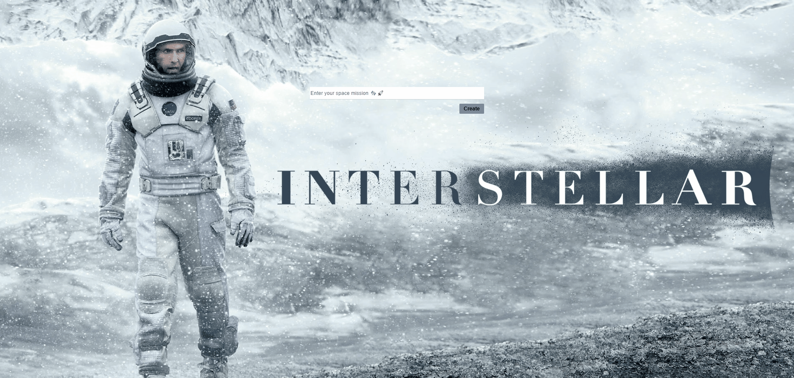
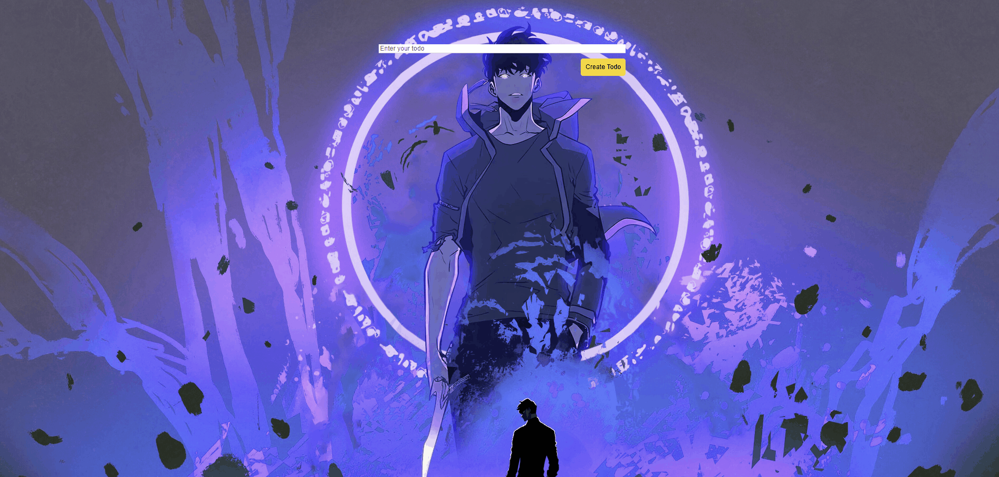

<h1 align="center">
  Welcome to My GitHub Profile!
  
</h1>

 <a href="https://github.com/DenverCoder1/readme-typing-svg">
   ;Passionate+About+Learning🧙‍♂️;Always+Exploring+New+Technologies">
 </a>

  

 

<h1 align="center" style="margin-top: -20px;">Hi, I'm Caner Yesiltas   </h1>

   

As a front-end developer and graduate of a 9-month Intensive Full Stack Software Development IT School, where I discovered that coding is the perfect mix of analytical thinking and creativity. ☄️ 
    
So far, I’ve built 20+ frontend projects, experimenting with React, TypeScript, Redux, and Next.js to deliver visually engaging and efficient apps. I’m always pushing myself to learn new technologies and refine my skills, and I look forward to sharing even more ambitious projects soon.

<h3 align="center" style="margin-top: -10px;">Frontend Developer with passion for React ♻️ </h3> 

  

<h3 align="center" style="color: #FFA500; margin-top: -10px;">Excited to contribute and grow with a team that's building the future of technology! 💯 </h3> 

## Why I Love Coding 🎮
I found my passion in coding because it combines problem-solving with creativity, making every project an opportunity to grow and innovate. For me, it's like a never-ending game - every new technology is a new level to master!

## About Me ⚡️

- TikTok Content Editor (2 years): Observed user engagement and digital trends firsthand, now I apply that knowledge to create user-friendly interfaces.
- Lived in Ireland and traveled around the US & Europe, which enhanced my adaptability, communication skills, and cultural awareness.
- Currently learning Japanese and volunteering in community projects, giving back is important to me!
- With a background in English Economics, I bring structured analytical thinking to every project.
- Always eager to explore different cultures, I hope to visit Japan one day! がんばります

  <a href="https://github.com/caner-yesiltas?tab=repositories">📂 Check out my projects in my GitHub repositories</a>

  

  

  
  
  <a href="https://github.com/caner-yesiltas">
    <picture>
      <source media="(prefers-color-scheme: dark)" srcset="https://streak-stats.vercel.app/?user=Caner-Yesiltas&theme=tokyonight&hide_border=false" />
      <source media="(prefers-color-scheme: light)" srcset="https://git-streak-stats.herokuapp.com/?user=Caner-Yesiltas&theme=tokyonight&hide_border=false" />
      
    </picture>
  </a>

  

  <!-- Core -->
  
  
  
  

  <!-- React-->
  
  
  
  
  
  

  <!-- Styling -->
  
  
  
  
  

  <!-- Testing  -->
  
  
  
  
  
  

  <!-- Deployment & Hosting -->
  
  

  <!-- Development  -->
  
  
  

  
  
  
  
  
  

  <h1>My Innovative ⚛️ Creations ♾️</h1>

| 📌 Project Name  (Live Demo) / Repo | ⚙️ Libraries and Technologies |🎬 Live Preview |
|--------------|----------------------------------|-------------------------|
| 
<a href="https://netflix-verse-eight.vercel.app/"><strong>🎬 Netflix Verse - (Live Demo) </strong></a>    
 | <ul> <li>Nextjs</li> <li>Context API</li> <li>Firebase Authentication</li> <li>Tailwind CSS</li> <li>React Loader Spinner</li> <li>Hero Icons</li>  <li>Fetch</li> <li>React Toastify</li> <li>TMDB API</li>  <li>Session Storage</li> <li>Headless UI</li> <li>Use-Debounce (Search Optimization)</li> </ul> |  |
| 
<a href="https://swift-store-rho.vercel.app/"><strong>🛍️ Swift Store - (Live Demo) </strong></a>    
 | <ul> <li>TypeScript</li> <li>Redux Toolkit</li> <li>React Router</li> <li>Tailwind CSS</li> <li>Axios</li> <li>React Toastify</li> <li>DummyJSON API</li> </ul> |  |
| 
<a href="https://sky-shop-swart.vercel.app/"><strong>⛈️ Sky Shop - (Live Demo) </strong></a>    
 | <ul> <li>React Router</li> <li>Context API</li> <li>Tailwind CSS</li> <li>Axios</li> <li>Session Storage</li> <li>DummyJSON API</li> <li>Lazy Loading</li> <li>Protected Routes</li> </ul> |  |
| 
<a href="https://umbrella-corporation-projects-2dbd.vercel.app/"><strong>☔ Umbrella Corporation Projects - (Live Demo)</strong></a>    
 | <ul> <li>TypeScript</li> <li>Material-UI</li> <li>Axios</li> <li>MockAPI</li> <li>SweetAlert2</li> </ul> |  |
| 
<a href="https://health-sync-two-liart.vercel.app/"><strong>🏥 HealthSync - (Live Demo)</strong></a>    
 | <ul> <li>React Bootstrap</li> <li>React Icons</li> <li>Complex State Management</li> <li>Custom Modal</li> <li>Local Storage</li> </ul> |  |
| 
<a href="https://quick-cart-gules.vercel.app/"><strong>🧺 Quick Cart - (Live Demo)</strong></a>    
 | <ul> <li>Redux Toolkit</li> <li>React Router</li> <li>Material-UI</li> <li>Axios</li> <li>Local Storage</li> <li>FakeStore API</li> </ul> |  |
| 
<a href="https://timely-haupia-7e5c56.netlify.app/"><strong>🧑‍🍳 Boston Recipe App - (Live Demo)</strong></a>    
 | <ul> <li>React Router</li> <li>Styled Components</li> <li>Axios</li> <li>Edamam API</li> <li>Lazy Loading</li> <li>Session Storage</li> </ul> |  |
| 
<a href="https://employee-management-system-three-jade.vercel.app/"><strong>📈 Employee Management System - (Live Demo)</strong></a>    
 | <ul> <li>React</li> <li>Tailwind CSS</li> <li>State Management</li> <li>Custom Modal</li> </ul> |  |
| 
<a href="https://todo-list-type-script-redux-eta.vercel.app/"><strong>🛰️ TodoList with TypeScript & Redux - (Live Demo)</strong></a>    
 | <ul> <li>TypeScript</li> <li>Redux Toolkit</li> <li>React Icons</li> </ul> |  |
| 
<a href="https://task-tracker-pro-dusky.vercel.app/"><strong>💾 Task Tracker Pro - (Live Demo)</strong></a>    
 | <ul> <li>React</li> <li>TypeScript</li> <li>State Management</li> </ul> |  |
| 
<a href="https://contact-app-bice-tau.vercel.app/"><strong>📞 Contact App - (Live Demo)</strong></a>    
 | <ul> <li>React</li> <li>Tailwind CSS</li> <li>Input Masking</li> <li>Local Storage</li> </ul> |  |
| 
<a href="https://currency-app-woad.vercel.app/"><strong>💱 Currency Converter - (Live Demo)</strong></a>    
 | <ul> <li>React</li> <li>Axios</li> <li>FreeCurrencyAPI</li> </ul> |  |
| 
<a href="https://task-flow-manager.vercel.app/"><strong>📝 TaskFlow Manager - (Live Demo)</strong></a>    
 | <ul> <li>React Bootstrap</li> <li>LocalStorage</li> <li>UUID</li> </ul> |  |
| 
<a href="https://legacy-xi-xi.vercel.app/"><strong>⚽ Legacy-XI - (Live Demo)</strong></a>    
 | <ul>  <li>React Bootstrap</li> <li>CSS Modules</li> </ul> |  |
| 
<a href="https://todo-list-psi-ecru.vercel.app/"><strong> ✅ Todo List - (Live Demo)</strong></a>    
 | <ul> <li>React Icons</li> </ul> |  |
| 
<a href="https://react-interview-questions-assigment.vercel.app/"><strong> 🎯 React Interview Q&A - (Live Demo)</strong></a>    
 | <ul> <li>React Bootstrap</li> </ul> |  |
| 
<a href="https://bucket-list-todo-project.vercel.app/"><strong> 🪣 Bucket List Todo - (Live Demo)</strong></a>    
 | <ul> <li>Vanilla JS</li> <li>DOM Manipulation</li> <li>SweetAlert2</li> <li>CSS3 Animations</li> <li>Font Awesome</li> </ul> |  |
| 
<a href="https://lord-of-the-rings-gallery.vercel.app/"><strong>💍 Lord of the Rings Gallery - (Live Demo)</strong></a>    
 | <ul> <li>Vanilla JS</li> <li>DOM Manipulation</li> <li>Flickr API</li> <li>CSS Animations</li> </ul> |  |
| 
<a href="https://hogwarts-stop-watch.vercel.app/"><strong>🧙‍♂️ Hogwarts Stopwatch - (Live Demo)</strong></a>    
 | <ul> <li>Vanilla JS</li> <li>DOM Manipulation</li> <li>CSS Animations</li> <li>Audio</li> </ul> |  |
| 
<a href="https://boot-strap-crunchyroll-anime-assigment.vercel.app/"><strong>🎌 Crunchyroll Anime Clone - (Live Demo)</strong></a>    
 | <ul> <li>Bootstrap 5</li> <li>Font Awesome</li> <li>CSS Animations</li> </ul> |  |

## 🎯 What’s Next

Frontend developer who believes coding is more than just building projects - it's about learning, teaching, and growing together! Excited to join a team where I can contribute while helping others level up. 

Can’t wait to connect and help build the future of technology!

  

 

  <h3><b>Let's get in touch!  
  </b></h3>

  <table>
    <tr>
      <td style="padding: 0 8px;"> 
        
      </td>
      <td style="padding: 0 8px;"> 
        
      </td>
      <td style="padding: 0 8px;">
        
      </td>
      <td style="padding: 0 8px;"> 
        
      </td>
      <td style="padding: 0 8px;"> 
        
      </td>
      <td style="padding: 0 8px;"> 
        
      </td>
      <td style="padding: 0 8px;"> 
        
      </td>
    </tr>
  </table>

  

  <strong> ~  Dynamic Random Quotes !~ </strong>

  

